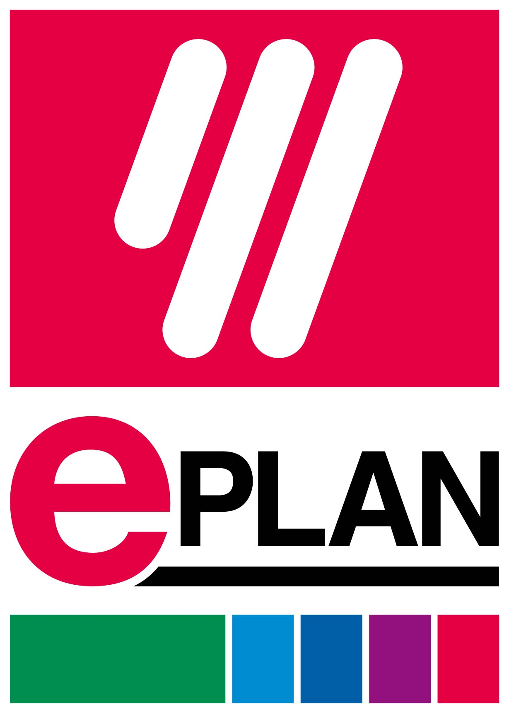
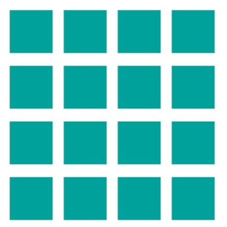

### Electrónica y Automatización Industrial

Buenos Aires, Argentina &nbsp;·&nbsp; Montevideo, Uruguay

---

`+1000 Proyectos Completados` · `+50 Clientes Activos` · `+20 Años de Experiencia en la Industria` · `Presencia en LATAM`

---

## 🏭 ¿Quiénes Somos?

En **Ingenia** potenciamos tus procesos productivos con **soluciones integrales de control y automatización** diseñadas para agregar valor y garantizar resultados sostenibles. Nuestro equipo de expertos, apasionados por la excelencia, **te respalda** como tu **socio estratégico** para integrar tecnología de vanguardia que transforma tu operación en la planta del futuro, maximizando **eficiencia, seguridad y competitividad.**

---

## ⚙️ Servicios

### Automatización Industrial

| Servicios    |
|-------------------|
| ⚙️ **Programación PLC, HMI & SCADA** |
| 🔌 **Tableros de Control y Potencia** |
| ⚡ **Ingeniería Eléctrica** |
| 🛠️ **Armado de tableros de control y potencia** |

### IIoT & Transformación Digital

| Servicio | Descripción |
|---|---|
| 📊 **Monitoreo en Tiempo Real** | Dashboards de producción, energía y eficiencia operativa |
| 🗄️ **Gestión de Datos Industriales** | Adquisición, almacenamiento y análisis de datos de planta |
| 📋 **Reportes Automatizados** | Generación y distribución automática de reportes operativos |
| ☁️ **Escalabilidad** | Desde un servidor en piso de planta hasta soluciones distribuidas o en la nube |

### Automatización & Control

&nbsp;

&nbsp;

&nbsp;

&nbsp;

&nbsp;

&nbsp;

### IIoT & Datos

&nbsp;

&nbsp;

&nbsp;

&nbsp;

&nbsp;

### Lenguajes & Desarrollo

&nbsp;

&nbsp;

&nbsp;

&nbsp;

---

## 👥 [Trabajá con Nosotros](https://ingenia.adhoc.ar/jobs)

Unite a nuestro Equipo y ayúdanos a transformar la industria.

&nbsp;

&nbsp;

---

© 2026 Ingenia Control SRL. Todos los derechos reservados.

